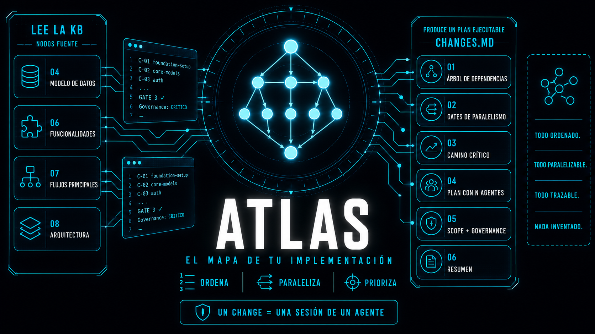

<div align="center">



# atlas

**El mapa operativo de tu implementación.** Una skill que convierte una base de conocimiento en `CHANGES.md`: el índice canónico de todos los changes para llevar un sistema de cero a producción — con dependencias, paralelismo y camino crítico explícitos.

[](LICENSE)
[](SKILL.md)
[](#más-a-fondo)
[](https://www.skills.sh/3zequiel3/atlas)

</div>

---

## Qué es

Toma tu `knowledge-base/` y produce **un solo archivo**: `CHANGES.md`. No es una lista de tareas — es un **plan de ejecución** que responde tres preguntas que un roadmap común deja abiertas: *qué puedo hacer en paralelo*, *qué es lo mínimo irreducible para llegar a producción*, y *qué tengo que leer antes de tocar cada change*.

```
proyecto/                             atlas                     CHANGES.md
├── knowledge-base/      ────────►  ┌───────────────┐  ──────►  ├── Árbol de dependencias
│   ├── 04_modelo_de_datos.md       │  dependencias │           ├── GATES de paralelismo
│   ├── 06_funcionalidades.md       │  + paralelismo│           ├── Camino crítico
│   └── 08_arquitectura_propuesta.md│  + governance │           ├── Plan con N agentes
└── openspec/                       └───────────────┘           └── C-01 · C-02 · … C-NN
```

Cada `C-NN` es **atómico**: un agente lo implementa en una sesión (~4-6 horas). Si no entra en una sesión, no es un change — son dos.

---

## Empezá acá

1. **Instalá la skill** — publicada en **[skills.sh](https://www.skills.sh/3zequiel3/atlas)**:
   ```bash
   npx skills add 3zequiel3/atlas
   ```
   > Funciona en Claude Code, Cursor, Codex, Gemini y demás agentes compatibles.
2. **Pedísela en lenguaje natural** — se activa sola al detectar la intención:
   ```text
   "generá el CHANGES.md del proyecto"
   ```
3. **Obtenés** `CHANGES.md` en la raíz, listo para arrancar con `/opsx:propose foundation-setup`.

Necesitás una KB previa. Si no la tenés, generala con **[chronicle](https://www.skills.sh/3zequiel3/chronicle)** — atlas es su continuación natural: chronicle documenta *qué es el sistema*, atlas planifica *cómo construirlo*.

---

## Qué genera

`CHANGES.md` tiene una estructura fija — es **contrato**, no sugerencia:

| Sección | Qué responde |
|---------|--------------|
| **Árbol de dependencias** | Qué bloquea a qué, en ASCII jerárquico legible de un vistazo. |
| **GATES de paralelismo** | Cada punto de sincronización y qué ramas se abren al cruzarlo. |
| **Camino crítico** | La cadena de dependencias más larga hasta producción — la cota inferior real del proyecto. |
| **Plan con N agentes** | Tabla paso × agente. `N` se ajusta al tamaño real del proyecto. |
| **Por cada change** | Estado, Scope operacional, Dependencias, Governance y "Leer antes". |
| **Resumen** | Métricas del plan: total, fases, camino crítico, gates, governance. |

```text
# Ejemplos de invocación
"generá el CHANGES.md del proyecto"        → generación limpia
"regenerá el CHANGES.md, cambié la KB"     → Modo Update (merge-safe)
"qué changes necesito para este sistema"   → generación limpia
```

---

## Por qué no es "un roadmap más"

Un roadmap clásico es **informativo**: qué viene y en qué orden. `CHANGES.md` es **operativo**: se ejecuta.

| Aspecto | Roadmap simple | `CHANGES.md` (atlas) |
|---------|----------------|----------------------|
| Dependencias | Tabla 1-a-1 | Árbol jerárquico + gates de sincronización |
| Paralelización | Implícita o nula | Explícita, asignada a agentes |
| Priorización con tiempo limitado | Difícil de inferir | Camino crítico marcado |
| Contrato con la documentación | Implícito | Sección "Leer antes" por change |
| Nivel de riesgo | No declarado | Governance: BAJO / MEDIO / ALTO / CRITICO |
| Scope | Descriptivo | Operacional: modelos, endpoints, migraciones, tests |
| Tracking de progreso | No | Checkboxes preservados entre regeneraciones |

---

## Regla de oro

> **El plan sale de la KB, no de la imaginación.**
> Las dependencias se **infieren** de los datos y los flujos documentados — nunca se inventan para que el árbol quede lindo.

Un `Scope` describe lo que el agente va a **generar**, no lo que el módulo *es*:

```diff
+ POST /api/auth/login — JWT access + refresh, rate limiting 5/60s por IP+email
- Sistema de autenticación completo con tokens

+ Migración 003: tablas allergen, product_allergen
- Crear las tablas de alérgenos
```

La diferencia no es de estilo: la primera versión es ejecutable por un agente sin volver a preguntar. La segunda abre una conversación.

---

## Más a fondo

<details>
<summary><b>📋 Pre-requisitos y pre-checks</b></summary>

atlas **se detiene** antes de generar nada parcial si falta un input. No genera a medias.

1. **Base de conocimiento** en `knowledge-base/` (raíz).
   - No requiere los 10 nodos canónicos — solo los que aplican al perfil del proyecto.
   - **Mínimo obligatorio**: `04_modelo_de_datos.md` y `08_arquitectura_propuesta.md`.
   - `06_funcionalidades.md` y `07_flujos_principales.md` se usan si están; si faltan, atlas avisa y sigue con lo que hay.

2. **OpenSpec inicializado**, porque `CHANGES.md` referencia comandos `/opsx:propose`:
   ```bash
   npx @fission-ai/openspec@latest init
   ```
   > ¿No usás OpenSpec? Decíselo al agente y atlas genera el plan sin las referencias a `/opsx:propose`, dejando la omisión documentada en el archivo. En modo orquestado, donde no hay a quién preguntarle, atlas toma esa rama sola en vez de frenar.

</details>

<details>
<summary><b>🔗 Cómo infiere las dependencias</b></summary>

Ocho reglas, aplicadas **en este orden** de prioridad:

1. **Infra primero** — si el proyecto necesita scaffolding, `C-01` es `foundation-setup` y no depende de nada.
2. **Modelos core antes que features** — entidades base, mixins, repositorios.
3. **Auth antes que recursos protegidos** — todo lo que requiere usuario logueado.
4. **Entidad referenciada antes que la que referencia** — `productos` antes que `pedidos`.
5. **Backend antes que frontend acoplado** — si la vista consume el endpoint, depende de él.
6. **Integraciones externas al final** — pagos, webhooks: dependen del dominio.
7. **Admin / dashboards al final** — dependen de los datos que muestran.
8. **Refactors visuales al final del todo** — requieren producto estable.

El orden importa: cuando dos reglas aplican al mismo change, gana la de número más bajo.

</details>

<details>
<summary><b>🛡️ Niveles de governance</b></summary>

Cada change declara su nivel de riesgo. No es decorativo: te dice **dónde poner los ojos** en la review.

| Nivel | Cuándo |
|-------|--------|
| **BAJO** | Scaffolding, CRUDs simples sin aislamiento, pages frontend sin lógica crítica, configuración. |
| **MEDIO** | Flujos con estado, sesiones, máquinas de estado, aislamiento multi-tenant, eventos WS no críticos. |
| **ALTO** | Notificaciones, gestión de roles, WS gateway, observabilidad. |
| **CRITICO** | Auth, pagos, datos de seguridad, audit trail, modelos core que todo referencia. |

</details>

<details>
<summary><b>♻️ Modo Update — merge-safe</b></summary>

Regenerar **no borra tu progreso**. Si `CHANGES.md` ya existe, atlas entra en Modo Update:

0. **Verifica que el archivo sea suyo.** `CHANGES.md` es un nombre de changelog común. Si el archivo no tiene el header de atlas ni un solo `### [C-NN]`, atlas se detiene y pregunta antes de tocarlo.
1. Lee el archivo actual y extrae los **nombres** de los changes completados.
2. Regenera el plan desde la KB actualizada, en memoria.
3. Restaura el estado de cada change que **sobrevivió** a la regeneración.
4. Si un change con progreso desapareció, lo lista bajo `## ⚠️ Changes eliminados (tenían progreso)` en vez de tragárselo en silencio.
5. **Recién ahí** escribe el archivo, una sola vez, con los checkboxes ya restaurados.
6. Te reporta cuántos se preservaron y cuántos se perdieron por restructuración.

> **Por qué el matching es por nombre y no por `C-NN`:** los IDs son posicionales. Si agregás una entidad a la KB, todo lo que venía después se renumera. Matchear por ID le pondría el `[x]` del viejo `C-05` a un change nuevo que nadie implementó. El nombre kebab-case es la identidad real del change; el ID es solo su posición en el plan de hoy.

> **Por qué un solo write:** entre escribir el archivo regenerado y aplicar los checkboxes hay una ventana en la que tu progreso no existiría en ningún lado del disco. atlas no abre esa ventana: compone todo en memoria y escribe una vez.

</details>

<details>
<summary><b>🤖 Modo orquestado — para SDD / CI</b></summary>

Si existe `.jr-orchestrator-state.json` (v2) en la raíz, atlas cambia de fuente de entrada:

- Lee `state.kb.files` como **lista autoritativa** de paths de la KB, verificando en disco que cada uno exista antes de leerlo.
- Lee `state.kb.discovery` como **hint de nombrado** (`system_type`, `domain`, `scale`, `needs_infra`) — nunca como fuente de verdad.
- Al cerrar, escribe **únicamente** `state.roadmap`. Jamás toca `step`, `owner`, `kb`, `skills` ni `agents`.

**Standalone-safe por diseño**: sin archivo de estado, el hook no corre y **atlas no lo crea**. El orquestador es el único creador; atlas solo actualiza. Así dos escritores nunca compiten por crearlo.

El contrato completo — schema, algoritmo condicional, manejo de JSON malformado y fallbacks — vive en [`assets/state-contract.md`](assets/state-contract.md).

</details>

<details>
<summary><b>✅ Qué te devuelve al cerrar</b></summary>

```text
✅ atlas — CHANGES.md generado

CHANGES.md creado en la raíz con 7 changes en 4 fases.

| Métrica              | Valor                   |
|----------------------|-------------------------|
| Camino crítico       | 6 changes               |
| Gates de paralelismo | 2                       |
| Governance CRITICO   | 2 changes               |
| Primer change recomendado | C-01 (foundation-setup) |

Para arrancar: /opsx:propose foundation-setup
```

Si fue una regeneración, suma la línea de preservación:

```text
Checkboxes preservados: 3 de 4 anteriores.
Changes eliminados con progreso: ingredients (era C-07).
```

</details>

<details>
<summary><b>🔄 Actualizar la skill</b></summary>

La skill es una copia traída de GitHub; **no se auto-actualiza**:

```bash
npx skills update                 # actualiza todas las skills instaladas
# o, puntual:
npx skills add 3zequiel3/atlas    # re-instala = trae la última de main
```

> Eso actualiza **la skill**. Actualizar **el plan** es otra cosa: pedí *"regenerá el CHANGES.md"* en lenguaje natural y entra en Modo Update.

</details>

<details>
<summary><b>📜 Changelog</b></summary>

### v3.2 — segunda ronda de auditoría

Los mismos dos revisores verificaron los fixes de v3.1 y encontraron defectos **introducidos por esa reescritura**. Corregidos:

- **Piso de "Leer antes" insatisfacible**: la KB mínima legal tiene 2 nodos, pero la regla exigía 3 paths verificados. En esa entrada válida ningún change pasaba la checklist y el workflow no podía terminar. Ahora la KB real manda sobre el piso.
- **Guard de archivo ajeno**: el Modo Update se disparaba con cualquier `CHANGES.md` — incluido un changelog común de otro proyecto — y lo sobrescribía en silencio. Ahora verifica que el archivo sea de atlas y pregunta si no lo es.
- **Compatibilidad con v3.0**: el cambio de formato del Estado hacía que la primera regeneración sobre un archivo viejo matcheara cero checkboxes y reportara "0 de 0". Ahora se leen las dos formas y se escribe siempre la nueva.
- **Invariante falso**: se exigía que el plan tuviera exactamente tantos pasos como el camino crítico. Solo vale con agentes ilimitados. Ahora la regla es "al menos tantos".
- **`N` indefinido**: un proyecto de 3-4 changes con un fork real debía emitir un plan sin `N` definido. Y el conteo chocaba con "ninguna columna vacía". Ahora el ancho del grafo acota al conteo, con precedencia declarada.
- **Hook de estado desacoplado del input**: corría solo en modo orquestado, así que un state file v2 con `kb.files` vacío dejaba al orquestador esperando para siempre.
- **Camino crítico sin filtro subjetivo**: la exclusión de "dashboards extra" hacía la métrica irreproducible y el propio ejemplo caía justo en el límite.
- **FASEs definidas**: agrupación por tema con restricción topológica dura, de la que depende que el invariante de IDs sea satisfacible.
- **Nombres únicos** exigidos: la identidad del merge no podía ser ambigua.
- **Sección de bajas** con forma definida (tabla `Change | ID anterior`) y posición fija, y el algoritmo ahora captura el ID viejo que esa fila necesita.
- **`state.roadmap.changes`** guarda `{id, name}`: el id era posicional y arrastraba la misma corrupción que se arregló en el Modo Update.
- **`byte-for-byte`** del state contract se reemplazó por preservación semántica, que es lo que un round-trip de JSON puede garantizar.
- **Ejemplo del template**: 7 changes completos en vez de 9 elididos. Ahora cada número del Resumen se cuenta en el propio archivo.

### v3.1 — auditoría adversarial

Dos revisores independientes auditaron la skill a ciegas. De 40 hallazgos, 15 fueron confirmados por ambos. Lo que cambió:

**Corrupción de datos**
- **Matching por nombre**: el Modo Update matcheaba por `C-NN`. Como los IDs se renumeran en cada regeneración, agregar una entidad a la KB podía estampar `[x]` sobre un change que nadie implementó. Ahora la identidad es el nombre kebab-case.
- **Un solo write**: el workflow escribía el archivo *antes* de restaurar los checkboxes. Cualquier corte en esa ventana borraba el progreso sin recuperación. Ahora se compone en memoria y se escribe una vez.
- **Estado clickeable**: el `` `[ ]` `` iba entre backticks, así que en GitHub nunca fue un checkbox real ni existía una forma canónica del estado "completado". Ahora es un task item GFM (`- [ ] **Estado**`), renderizable y parseable.

**Corrección del plan**
- **Camino crítico**: estaba definido como *"la cadena más corta"*. Un camino crítico es la cadena **más larga** — es la cota inferior de la duración. La regla anterior producía caminos que salteaban dependencias obligatorias, y el ejemplo de referencia lo demostraba.
- **GATES**: solo se emiten en forks (2+ ramas) y joins (2+ predecesores). Los tramos lineales dejaron de contar como gates, así que la métrica del Resumen es reproducible.
- **FASEs**: numeración entera sin sufijos `1A`/`1B`, para que la métrica `Fases` sea contable.
- **Governance**: nada con seguridad, permisos o aislamiento de datos puede marcarse BAJO.

**Contratos**
- **Una fuente de verdad por artefacto**: `SKILL.md` ya no duplica el esqueleto del output. 8 de los 11 hallazgos críticos eran drift entre copias, no errores de lógica.
- **Estado orquestado completo** en `SKILL.md`, con los 5 campos, re-lectura antes de escribir y preservación de claves desconocidas.
- **Pre-check de KB en modo orquestado**: antes se salteaba, y una corrida podía fabricar el grafo entero sin modelo de datos.
- **Paths reales**: en modo orquestado, "Leer antes" usa los paths de `state.kb.files` en vez de `knowledge-base/` hardcodeado.
- **Verificación en disco** de cada path de "Leer antes" antes de escribirlo.
- **Modo sin OpenSpec** definido explícitamente (4 pasos en vez de 5), en vez de dejarlo a criterio.
- **Checklist de validación** ahora se ejecuta: es el paso 14 del workflow, antes no la invocaba nadie.
- **Template legible**: los fences anidados rompían el markdown y la mitad del archivo renderizaba invertida.

### v3.0 — atlas

Renombrado de `roadmap-generator` a **atlas**, con la corrección de los defectos que hacían fallar la generación en proyectos reales:

- **KB por perfil**: el pre-check de "los 10 canónicos" ya no falla en KBs de chronicle que omiten slots a propósito.
- **Modo Update merge-safe**: regenerar preserva el progreso en vez de pisarlo.
- **Orquestación self-contained**: el path crítico ya no obliga a leer `state-contract.md`.
- **Existencia en disco** verificada para cada archivo de `state.kb.files`.
- **OpenSpec contextual**: el pre-check es omitible si el proyecto no usa OpenSpec.
- **JSON malformado o vacío** manejado en el algoritmo de escritura del estado.
- **Plan con N agentes** ajustado al tamaño real (no siempre 3).
- **Proyectos chicos**: GATES y plan multi-agente se omiten cuando no hay paralelismo real.
- **Tabla Resumen** definida y obligatoria en el output.
- **Nodos ausentes** notifican y continúan en vez de fallar en silencio.
- **Referencias a `chronicle`** corregidas (antes apuntaban a `kb-creator`).

### v2.0 — roadmap-generator

Versión inicial, con estado integrado para jr-orchestrator.

</details>

---

## Contribuir

Las contribuciones son bienvenidas. Abrí un issue para discutir cambios grandes antes de un PR. La skill vive en `SKILL.md` (el contrato) y `assets/` (los recursos cargados bajo demanda).

## Licencia

[Apache-2.0](LICENSE) — proyecto original de Ezequiel González.
